# 實驗器材

## 一、名詞定義

| 名稱           | 定義                                                         |
| -------------- | ------------------------------------------------------------ |
| PID 循線車     | 單感測器，採用 PID 演算法控制車子。                          |
| 邏輯判斷循線車 | 單感測器，採用條件判斷式控制車子                             |
| 傳統循線車     | 雙感測器，且感測器為數位訊號。使用條件判斷式來控制車子。為市面上最常見的循線車。 |
| Error          | 和參考值比較運算出來的誤差值                                 |

## 二、實驗器材

### Arduino Mega 2560

車子的主控版，程式上傳後透過它控制各個感測器與馬達。

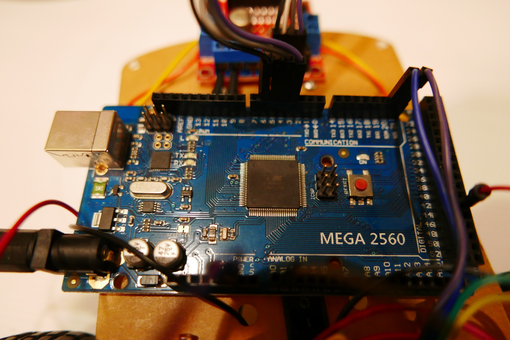

### TCRT5000 感測器

使用紅外線偵測亮度。此型號感測器支援數位與類比輸出。

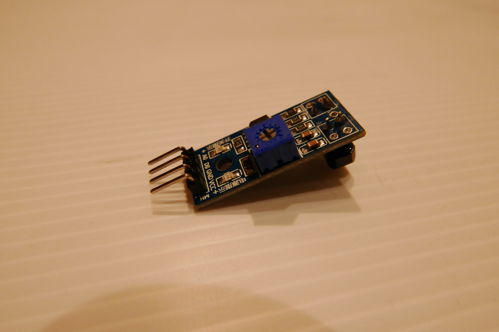

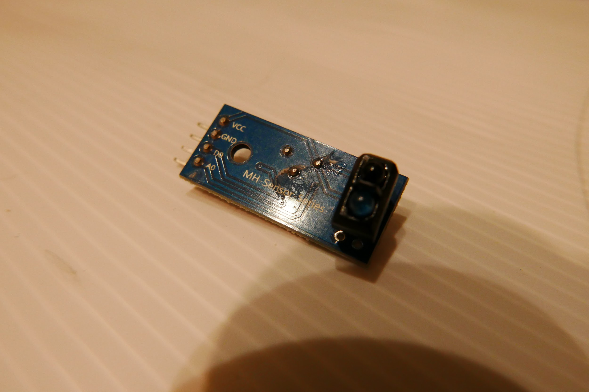

### L298N 馬達驅動板

利用電壓差控制馬達正反轉和變速。

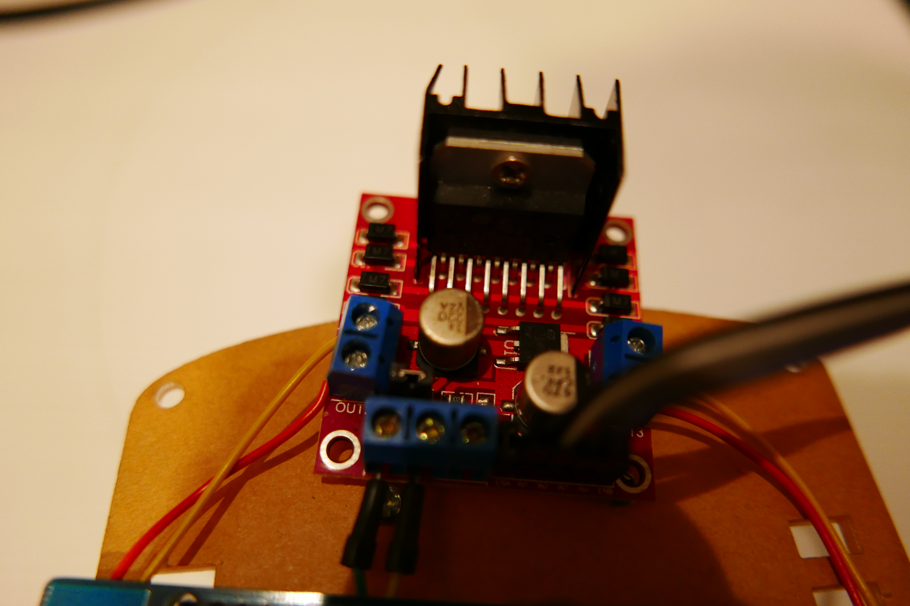

### TT 直流減速馬達

驅動車子移動、轉向。減速馬達指降低馬達轉速以提升扭力，帶動車子行駛。

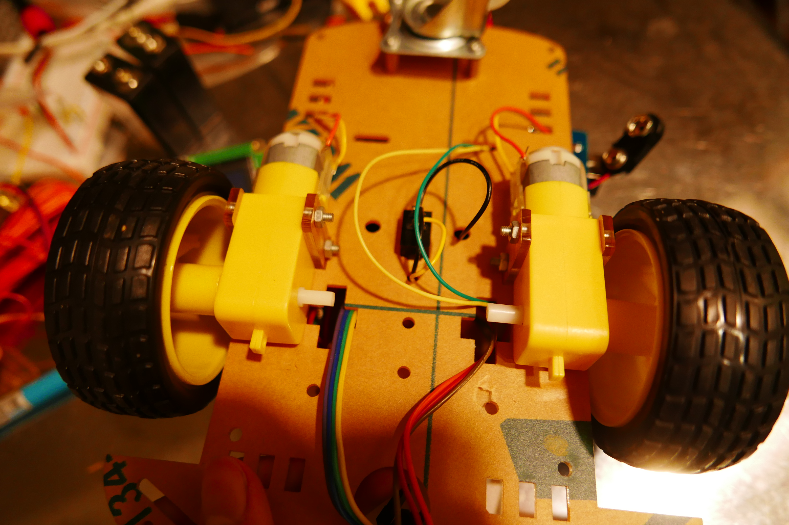

### LCD I2C 液晶螢幕

顯示器，顯示error、時間等訊息。

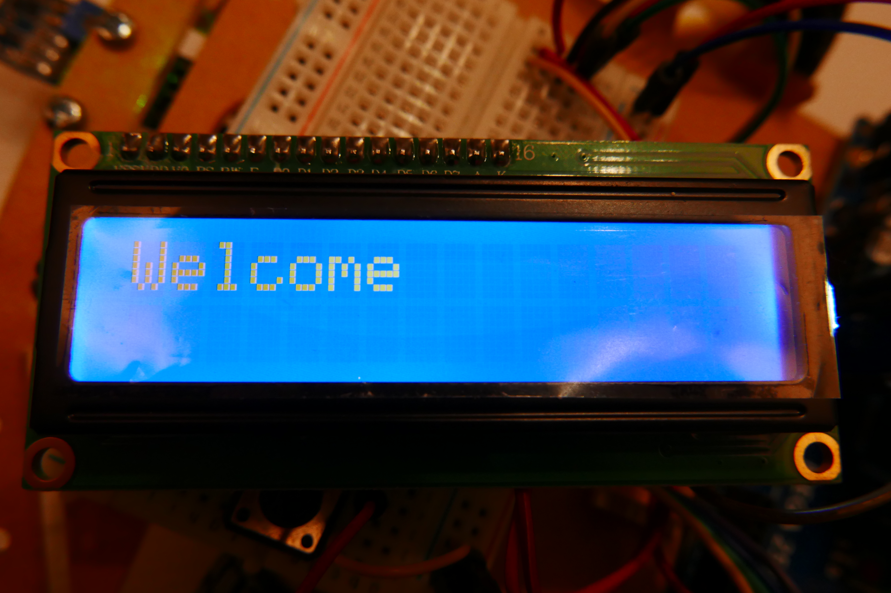

### SD 卡模組

使用 SD 卡紀錄資料

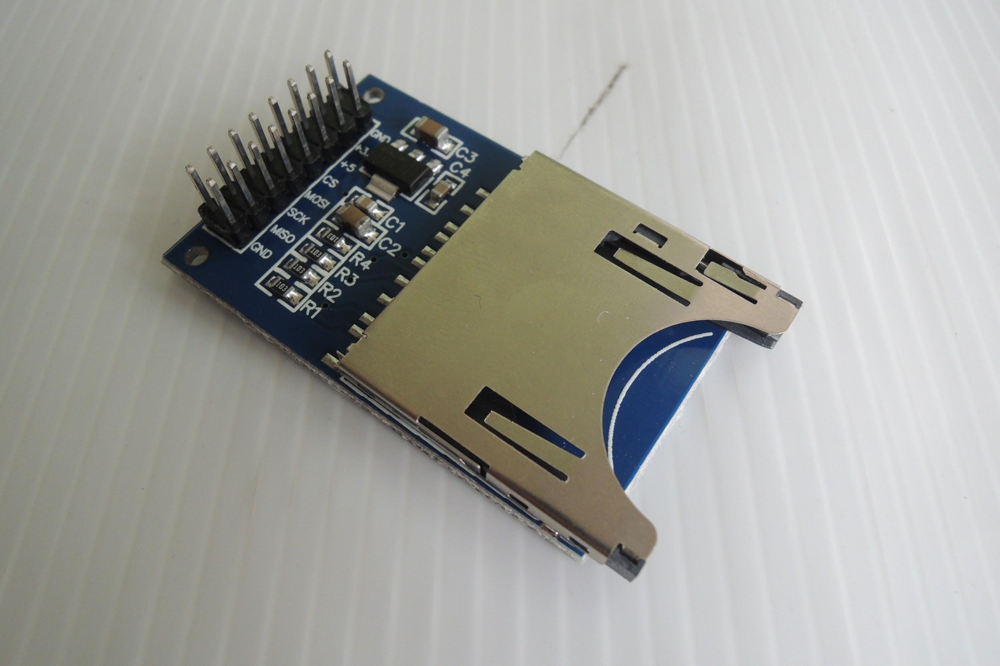

### 9V 充電電池

電源，供應馬達與Arduino板的電力。

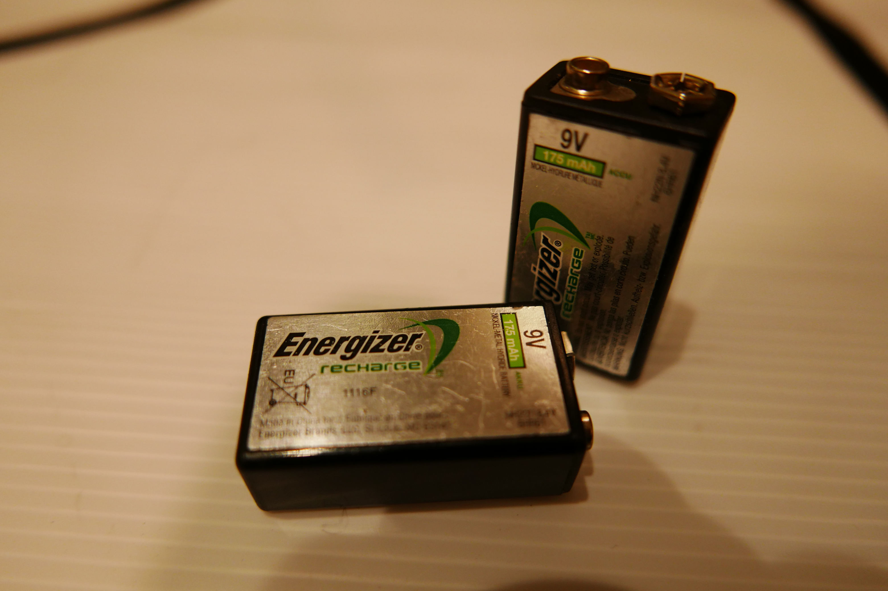

## 三、研究使用軟體

### [Arduino IDE]()

程式開發環境，用來編寫、編譯及上傳程式。

### [Git]()

進行版本控制、紀錄更改

### [Fritzing]()

電路圖繪製軟體

## 四、裝置接線圖

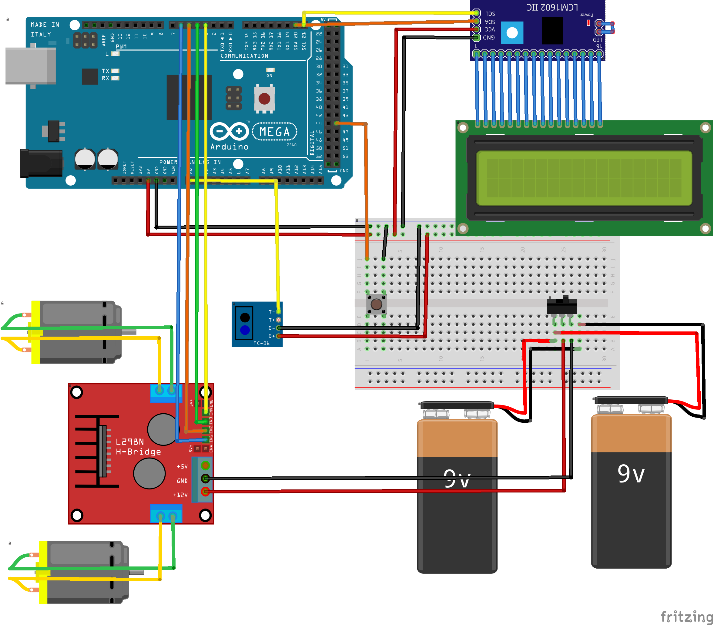

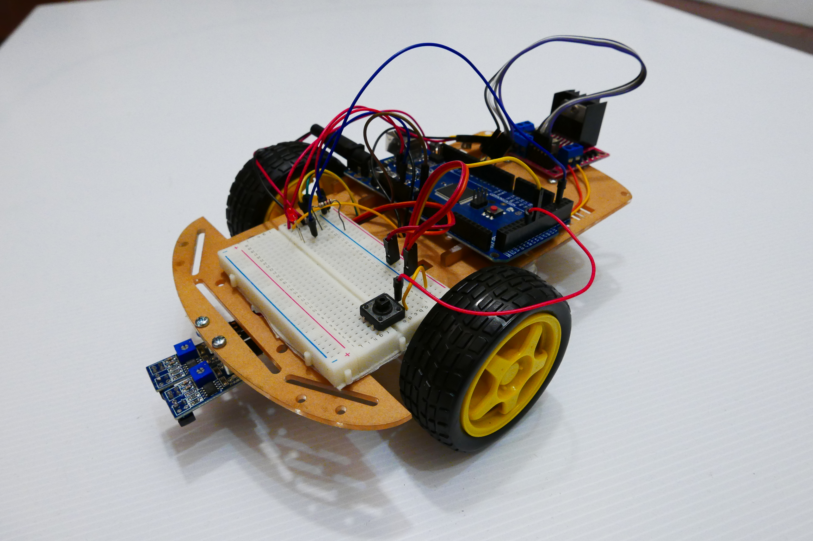

## 五、馬達運作程式

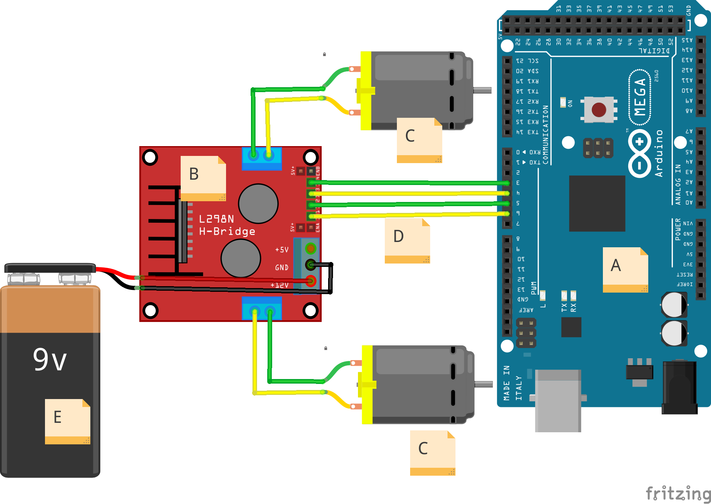

 A：Arduino 板

 B：馬達驅動板

 C：直流減速馬達

 D：訊號線

 E：外接電源

當連接一顆馬達的兩訊號線電壓不同時，即可控制馬達轉動（見下表）。我們有編寫函數控制此動作。（完整程式見附錄3）

| 訊號 1 | 訊號 2 | 馬達反應 |
| ------ | ------ | -------- |
| LOW    | LOW    | 停止     |
| HIGH   | LOW    | 馬達正轉 |
| LOW    | HIGH   | 馬達反轉 |
| HIGH   | HIGH   | 停止     |

