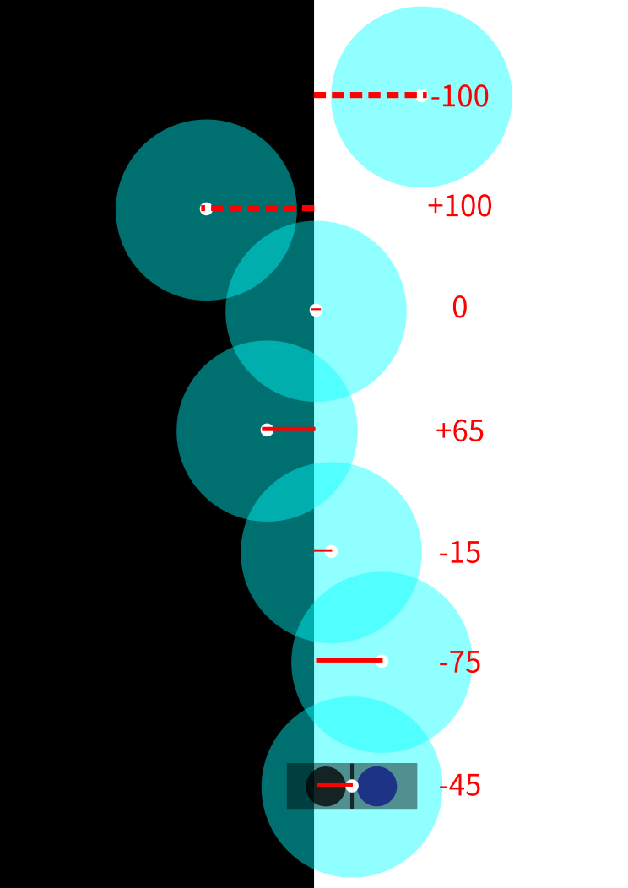

# 二、邏輯判斷循線車

### （一）單感測器運作原理

單感測器的循線感測器上僅有一組發射器和接收器，接收器會不斷的接收發射器發出紅外線反射回來的亮度，亮度越大時值越低，反之則越高，由於黑色會吸收較多紅外線，所以反射回來的紅外線亮度低，造成黑線比白線得到更大的值。此值範圍是 0~1023，經實驗測量，晚上時黑線亮度約 750，白線約 50。

因為環境中的其他光源都會影響接受器送出的數值造成誤差，為了適應環境變化，程式會隨時修正取回的最大值和最小值，並透過**正規化**將結果轉換成-100~100之間的相對值，其中的數值0代表最高和最低的算術平均數，作為參考值，因此參考值是動態變化。

這個轉換後的相對值我們定義為和參考值間的誤差（在程式和後續討論以 **error** 來表示），是本研究作為判斷循線優劣的依據。程式邏輯如下（函式名get_value）：

``` c
全域變數 H = 0; //過去紀錄過的最高值
全域變數 L = 100000; //過去紀錄過得最低值

float get_value() {
    float x = 類比輸入();
    if (x > H) {
        H = x; //覆寫最高值
        return 100;
    } else if (x < L) {
        L = x; //覆寫最低值
        return -100;
    } else {
        float mid = (H + L) / 2; //平均值
        return (x - mid) / (H - L) * 200 //將 x 縮放到正負 100 之間
    }
}
```

如果讀到的數值（稱為 x ）大於 H，就將 H 設定為 x ，並回傳極限值 100，反之則相反。如果介於 H 和 L 之間，就將 x 轉換為正負 100 之間並回傳。

運算出的error和感測器位置關係圖如下：



上圖中，青色的圓圈代表感測器範圍，黑色的大長方形代表黑線。經正規化後，在黑白交界正中央 error 值為 0；全在黑線上時 error 為 +100；全不在黑線上（全白）時 error 為 -100。

（二）程式

程式迴圈會不斷取得 error，定義一個直走範圍 range，如果 error 大於 range 就右轉，如果 error 小於負 range 就左轉，如果在 range 之內就直走。

``` c
常數 range = 30

void loop() {
    float error = get_value();
    if (error > range) {
        向右修正;
    } else if (error < range) {
        向左修正;
    } else {
        直走;
    }
}
```


