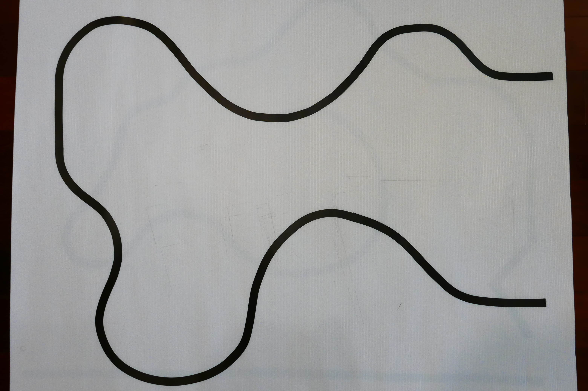
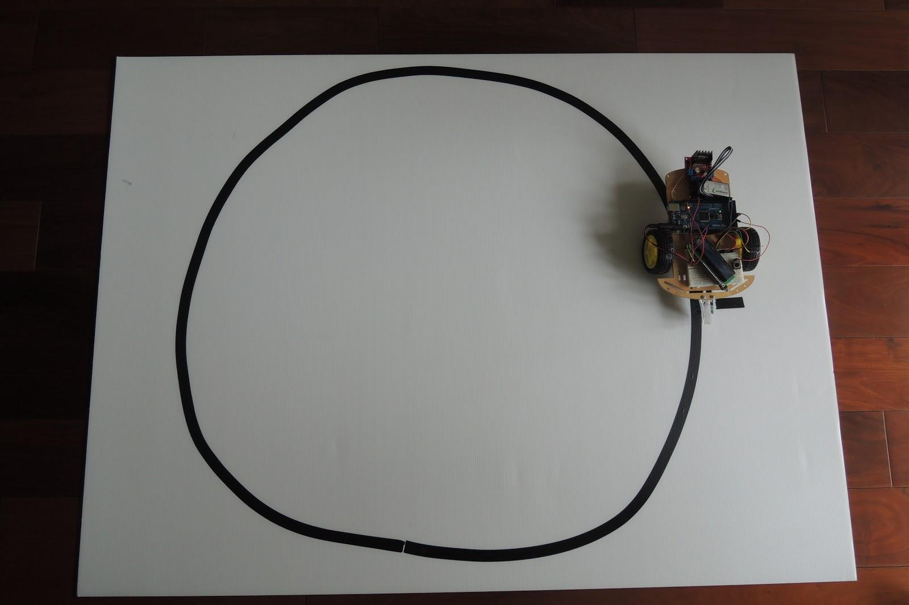

# 四、實驗設計

### （ㄧ）調整 PID 參數實驗

#### 實驗目的

為了取得最佳的 Kp、Ki、Kd 值，分別調整三項參數進行測試，在車子運行時，每 50 毫秒記錄一次 error，並將資料儲存在 SD 卡，用於觀察不同參數時，時間與 error 值的關係。實驗總共測試七組參數，其中 Kp：0.4、Ki：0.5、Kd：40 為預設值。如下：

|        | P    | I    | D    |
| ------ | ---- | ---- | ---- |
|        | 0.2  | 0.2  | 20   |
| 預設值 | 0.4  | 0.5  | 40   |
|        | 0.6  | 0.8  | 60   |

實驗方法為一次改變Kp、Ki、Kd其一參數，並將其他兩項設定為預設值。

#### 實驗器材

使用 SD 卡模組讀寫 SD 卡，為了避免車子運行中因為讀寫檔案而拖慢速度，在運行中使用二維陣列來記錄「時間」和「error」，總共記錄 200 筆資料，當 200 筆記錄完後車子自動停車，並將資料寫入 SD 卡中。

#### 測試場地

我們製作出由曲線構成的測試場地。

### （二）傳統、邏輯、PID 循線車比較

為了比較PID演算法是否比其他方式有效，我們製作一個環形跑道，實驗傳統循線車、邏輯判斷循線車、PID循線車繞1圈分別需要的平均時間。

