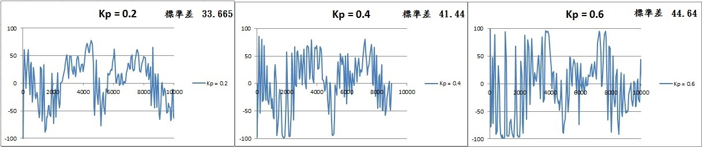
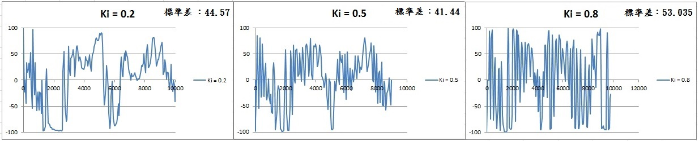
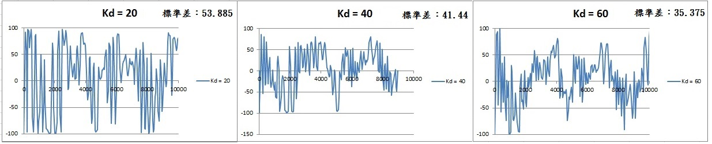

# ㄧ、調整 PID 參數對 error 的影響

### （ㄧ）不同 Kp 時 error 和時間的關係

將Ki、Kd固定為0.5、40，Kp分別以0.2、0.4、0.6進行實驗，得到error對時間的關係圖，並計算出標準差分別為
33.665、41.44、44.64：

### （二）不同 Ki 時 error 和時間的關係

將Kp、Kd固定為0.4、40，改變Ki大小為0.2、0.5、0.8，得到error對時間的關係圖，並計算出標準差分別為44.57、41.44、53.035：

### （三）不同 Kd 時 error 和時間的關係

將Kp、Ki固定為0.4、0.5，改變Kd的大小為20、40、60，得到error對時間的關係圖，並計算出標準差分別為53.885、41.44、35.375：

